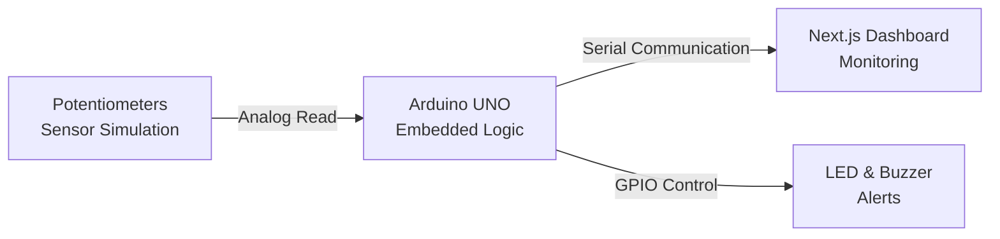

# 🚗 AI-Powered Road Accident Prevention & Emergency Response System

## 📌 Project Overview

This project presents a prototype of an intelligent automotive safety system designed to detect road accidents, monitor driver health conditions, and trigger a smart emergency response mechanism.

The system integrates:

* **Embedded Systems** (Arduino UNO)
* **Real-Time Decision Logic**
* **Web Dashboard** (Next.js)
* **Serial Communication**
* **Hardware Simulation** (Tinkercad)

The primary goal is to simulate and validate a real-world accident prevention and emergency alert system before integrating actual hardware sensors.

---

## 🧠 Problem Statement

Road accidents often result in delayed emergency response due to:

* Lack of real-time accident detection.
* Driver unconsciousness.
* No automatic alert mechanism.
* Absence of health monitoring.

**This system aims to solve these issues by:**

* Detecting accident conditions instantly.
* Monitoring for abnormal heart rates.
* Detecting alcohol influence.
* Providing a smart emergency delay mechanism to prevent false alarms.
* Enabling real-time dashboard monitoring.

---

## 🏗 System Architecture



---

## 🔬 Prototype Hardware Implementation

> **⚠️ Important Note:** In this prototype phase, actual sensors are not used. Instead, **potentiometers** are used to simulate sensor signals for safe and controlled testing.

### Sensor Simulation Mapping

| Real Sensor | Function | Prototype Simulation |
| --- | --- | --- |
| **MPU6050** | Acceleration detection | 3 potentiometers (`A0`, `A1`, `A2`) |
| **MAX30102** | Heart-rate monitoring | 1 potentiometer (`A3`) |
| **MQ-3** | Alcohol detection | 1 potentiometer (`A4`) |

**This approach allows for:**

* Controlled threshold testing.
* Safe accident simulation.
* Rapid debugging.
* Hardware-independent logic validation.

*Actual sensors will replace potentiometers in the final hardware implementation.*

---

## 🛠 Hardware Components Used (Prototype)

* Arduino UNO R3
* Breadboard (Normal Full-Size)
* 5x Potentiometers (Sensor Simulation)
* 1x Push Button (Emergency Cancel)
* 1x Buzzer
* 1x LED
* Jumper Wires
* USB Power Cable

---

## ⚙️ Embedded System Features

The Arduino module implements the following core logic:

1. **Accident Detection:** Calculates acceleration magnitude and utilizes threshold-based impact detection.
2. **Heart Rate Monitoring:** Detects abnormal heart rates (<40 BPM or >150 BPM).
3. **Alcohol Detection:** Detects alcohol levels beyond a safe threshold.
4. **Smart 20-Second Emergency Delay:** Prevents false emergency alerts and gives the conscious driver a window to cancel the emergency.
5. **Edge-Triggered Logic:** Prevents repeated emergency restarts.
6. **Non-Blocking Alerts:** Real-time LED and Buzzer blinking without utilizing `delay()` (prevents system freezing).

---

## 🌐 Dashboard Module (Next.js)

The web dashboard provides a clean interface for remote monitoring of system behavior:

* Live Acceleration Value
* Live Heart Rate
* Live Alcohol Level
* Emergency Status Monitoring
* Real-Time Updates

---

## 📸 Hardware Simulation

### 🖥 Tinkercad Circuit Setup


### 📊 Serial Monitor Output


---

## 📂 Project Structure

```text
Ai-Powered_road_accident_prevention/
│
├── Dashboard/       # Next.js Frontend
├── Arduino/         # Embedded System Code (.ino)
├── Docs/            # Images and Diagrams
└── README.md        # Project Documentation

```

---

## 🚀 How to Run the Dashboard

Navigate to the dashboard directory and install the required dependencies:

```bash
cd Dashboard
pnpm install
```

Start the development server:

```bash
pnpm dev
```

Open your browser and navigate to: [http://localhost:3000](http://localhost:3000)

---

## 🔮 Future Scope

This prototype establishes the foundation for a fully integrated hardware system. Future upgrades will include:

* Real MPU6050, MAX30102, and MQ-3 Sensor Integration.
* GPS Module for precise location tracking.
* SMS Alert System (GSM Module / Twilio).
* AI-Based Severity Classification.
* Drowsiness Detection using Computer Vision.
* Cloud-Based Alert System.
* Comprehensive Data Logging and Analytics.

---

## 🎓 Academic Value

This project successfully demonstrates:

* Embedded System Design & State Machine Logic.
* Real-Time Event Detection.
* Hardware Simulation Techniques.
* IoT Architecture Design.
* Web Dashboard Integration.
* Structured Git Project Management.

---

## 👨‍💻 Author

**Krishna Chadda**  
B.Tech CSE (AI & ML Specialization)

*Mini Project – 2026*

---

> **Conclusion:** This project successfully simulates an AI-powered road accident prevention system using a modular architecture approach. The prototype validates the core logic using potentiometer-based signal emulation and establishes a robust foundation for full hardware and AI integration in future development phases.

---